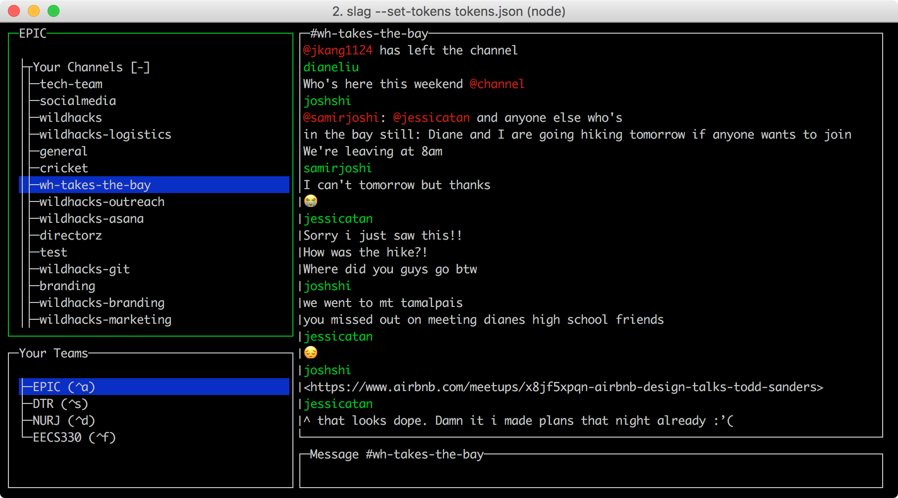

# slack terminal client
use slack in your terminal with an ncurses-style text-based gui.



## what this client supports right now
- chatting (public channels, private channels, DMs, etc)
- slash-commands from slack's hidden api!!
- @- and #-mentions
- emoji 🙌🏽

## what this client doesn't support/has trouble supporting (as of right now)
- images/gifs (for obvious reasons)
- files and links (they get printed out, but if they're too long they can go off the screen)

## how to run:
if you want to be able to run it from anywhere, make sure you have npm installed and run
```
npm install -g slag-cli
```
you'll need tokens for each team you'd like to use in slag. You can generate tokens for your team [here](https://api.slack.com/docs/oauth-test-tokens)

to register a token with slag, type
```
slag --add-token <your-token> --team <team-name>
```

if you'd like to add multiple teams at once, you can simply make your own json file and type
```
slag --set-tokens <path-to-your-tokens-json>
```

if you choose to set your json manually, it should be structured like this:
```
[
		{
				"team": "ATEAM",
				"token": "xoxp-***"
		},
		{
				"team": "ANOTHER_TEAM",
				"token": "xoxp-***"
		}
]
```

once you've registered at least one token, you should be able to run slag from anywhere (assuming you've installed it globally) in your command line by typing:
```
slag
```

## how to use
|Key  |Action|
|---	|---	|
|Tab  |Switch between channel tree and message input|
|Ctrl+T|Cycle through teams|
|Ctrl+C|Quit|
|Esc  |Quit|

## how to contribute
clone this repo, then from inside the project directory run
```
npm install
```
and have at it. do the tokens thing too though.

## notes:
this project uses a json file generated by [jollygoodcode's emoji-keywords](https://github.com/jollygoodcode/emoji-keywords) to translate slack's `:emoji-code:` into unicode under the MIT license

## license
idk i guess we use the [MIT license](/license)
